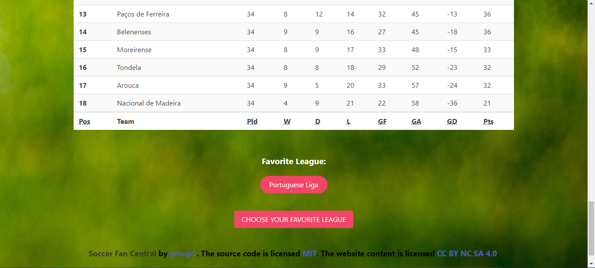

# Football Fan Central

## Purpose
Football Fan Central was created for soccer fans all around the world to follow their favorite league/team that was recorded throughout history.

## Built with
* HTML
* CSS
* JavaScript
* Bulma (CSS Framework)
* Two Server-Side APIs
  * Highlights: https://www.scorebat.com/video-api/
  * Standings: https://github.com/azharimm/football-standings-api

## Website 
https://cheesecakeassassin.github.io/football-fanpage/

## GitHub repository 
https://github.com/cheesecakeassassin/football-fanpage

## Working page screenshots 

## Contributions
❤️Made by [Mohammed-Boussada], [Sebastian-Santa], and [Souhila-Boukari]
